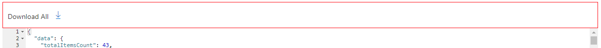
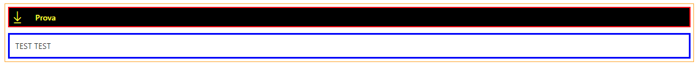
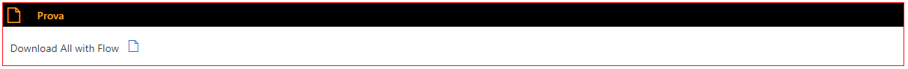

# PnP Modern Search - DG Extension

This project centralizes extensibility code made by my for the [PnP Modern Search solution (v4)](https://github.com/microsoft-search/pnp-modern-search). This project include:

- Custom web components
- Custom Handlebars helpers

This code is from [PnP Modern Search solution (v4)](https://github.com/microsoft-search/pnp-modern-search-extensibility-samples)

## Get Started

- Install and configure the [PnP Modern Search - Extensibility samples](https://microsoft-search.github.io/pnp-modern-search/installation/) in your SharePoint Online environment. (GUID: cd44d351-d45a-4c20-8eed-8d75cae02282)

## Web Components

**Demo components:**  
Usati per sperimentare. Non verranno descritti.
Used to experiment. They will not be described.

- dg-custom-component
- dg-demo-component

**Generic components:**  

- [msys-border](#border-component)
- [msys-title-border](#title-border-componet)
- [msys-css-loader](#css-loader)
- [msys-download-all](#download-files)
- [msys-call-flow](#invoke-power-automate-flow)
- [msys-results-excel](#download-search-results-in-excel-file)

## Components description

### Border Component

Questo componente permette di definire un area con un bordo in cui inserire altri componenti.  
This component allows you to define an area with a border in which to insert other components.

<details>
  <summary>Details</summary>

```html
<msys-border 
    data-color="" 
    data-size="" 
    data-hide="" 
    data-class-name="" 
    data-css-url="">
    <template id="border-content">
        {content}
    </template>
</msys-border>
```  

| Property          | Description                                                                                                        |
| ----------------- | ------------------------------------------------------------------------------------------------------------------ |
| `data-color`      | string - color code. | Border color.                                                                        |
| `data-size`       | number - in pixel. Pixel size of the border.                                                                  |
| `data-hide`       | boolean - true | false. Hide the edge.                                                                         |
| `data-class-name` | string. Class assigned to the parent container.                                                                |
| `data-css-url`    | string. Url of the external CSS file.                                                                                  |
| `template`        | `<template id="border-content">{content}</template>`. The content.                                                |

#### Examples Border

```html
<msys-border 
    data-color="red" 
    data-size=1 
    data-hide=false 
    >
    <template id="border-content">
        <div class="template--resultCount">
            <msys-download-component data-label="Download All" data-content="{{JSONstringify this 2}}" data-icon="Download"></msys-download-component>
        </div>
    </template>
</msys-border>
```


  
</details>

### Title Border Componet

Questo componente permette di definire un'area con un bordo e un titolo in cui inserire altri componenti.  
This component allows you to define an area with a border and a title in which to insert other components.

<details>
  <summary>Details</summary>
  
```html
<msys-title-border 
    data-color="" 
    data-size="" 
    data-hide="" 
    data-hide-title="" 
    data-icon="" 
    data-title="" 
    data-title-bkg-color=""
    data-text-color="" 
    data-class-name="" 
    data-title-class-name="" 
    data-body-class-name="" 
    data-css-url="">
    <template id="border-content">
        {content}
    </template>
</msys-title-border>
```  

| Property          | Description                                                                                                        |
| ----------------- | ------------------------------------------------------------------------------------------------------------------ |
| `data-color`      | string - codice colore. | Colore del bordo.                                                                        |
| `data-size`       | number - in pixel. Dimensione in pixel del bordo.                                                                  |
| `data-hide`       | boolean - true | false. Nasconde il bordo.                                                                         |
| `data-hide-title` | boolean - true | false. Nasconde il titolo.                                                                        |
| `data-icon`       | string - fabric ui icon name. Icona nel titolo.                                                                    |
| `data-title`      | string. Il titolo                                                                                                  |
| `data-title-bkg-color`      | string - codice colore. Sfondo del titolo.                                                               |
| `data-text-color` | string - codice colore. Colore dei caratteri del titolo.                                                           |
| `data-class-name` | string. Classe assegnata al contenitore principale.                                                                |
| `data-title-class-name` | string. Classe assegnata al contenitore del titolo.                                                          |
| `data-body-class-name` | string. Classe assegnata al contenitore del contenuto.                                                        |
| `data-css-url`    | string. Url del file CSS esterno.                                                                                  |
| `template`        | `<template id="border-content">{content}</template>`. Il contenuto.                                                |  

#### Examples Title Border

```html
<style>
    /* Insert your CSS overrides here */
    .test1 {
        margin-bottom: 10px;
        padding: 5px;
        border: orange solid 1px;
    }

    .test2 {
        border: red solid 2px;
    }

    .test3 {
        border: blue solid 3px;
        margin-top: 10px;
    }
</style>
<msys-title-border 
    data-color="red" 
    data-size=1 
    data-hide=true 
    data-hide-title=false
    data-icon="Download" 
    data-title="Prova" 
    data-text-color="yellow" 
    data-title-bkg-color="black"
    data-class-name="test1"
    data-title-class-name="test2"
    data-body-class-name="test3"
    data-css-url=""
    >
    <template id="border-content">
            <div class="template--resultCount">
                TEST TEST                   
        </div>
    </template>
</msys-title-border>
```



```html
<style>
    /* Insert your CSS overrides here */
    .lele1 {
        margin-bottom: 10px;
    }            
</style>
<msys-title-border 
    data-color="red" 
    data-size=1 
    data-hide=false 
    data-hide-title=false
    data-icon="Page" 
    data-title="Prova" 
    data-text-color="orange" 
    data-title-bkg-color="black"
    data-class-name="lele1"
    data-title-class-name="lele2"
    data-body-class-name="lele3"
    data-css-url=""
    >
    <template id="border-content">
        <div class="template--resultCount">
            <msys-invoke-flow-component data-content="{{JSONstringify this 2}}" data-label="Download All with Flow" data-list-settings="Settings" data-settings-key="SPFX_InvokeFlowComponent" data-icon="Page"></msys-invoke-flow-component>
        </div>
    </template>
</msys-title-border>
```



</details>
  
### Css Loader

Questo componente permette di inserire un riferimento a un file css esterno.  
This component allows you to insert a reference to an external css file.

<details>
  <summary>Details</summary>
  
```html
<msys-css-loader data-css-url=""></msys-css-loader>
```  

| Property          | Description                                                                                                        |
| ----------------- | ------------------------------------------------------------------------------------------------------------------ |
| `data-css-url`    | La url del file stylesheet.                                                                                        |

</details>

### Download Files

Questo componente permette di fare il download di tutti i file contenuti nei risultati della ricerca. Scarica un file alla volta.  
This component allows you to download all the files contained in the search results. Download one file at a time.

<details>
  <summary>Details</summary>
  
```html
<msys-download-all data-label="Download All" data-content="{{JSONstringify this 2}}" data-icon="Download"></msys-download-all>
```  

| Property          | Description                                                                                                        |
| ----------------- | ------------------------------------------------------------------------------------------------------------------ |
| `data-content`    | Il contesto della search result webpart.                                                                           |
| `data-label`      | Il testo vicino al bottone.                                                                                        |
| `data-icon`       | L'icona del bottone.                                                                                               |
  
</details>

### Invoke Power Automate Flow

Questo componente chiama un flow Power Automate di tipo HTTP Trigger con i seguenti parametri.  MANCA DESCRIZIONE LISTA SETTINGS

This component calls a Power Automate flow of type HTTP Trigger with the following parameters.

```json
{
    "siteUrl": "<absolute url>",
    "data": "queryText",
    "userEmail": "userEmail"
}
```

<details>
  <summary>Details</summary>
  
```html
<msys-call-flow data-content="{{JSONstringify this 2}}" data-label="Download All with Flow" data-list-settings="Settings" data-settings-key="SPFX_InvokeFlowComponent" data-icon="Page"></msys-call-flow>
```  

| Property                   | Description                                                                                                        |
| -------------------------- | ------------------------------------------------------------------------------------------------------------------ |
| `data-content`             | Il contesto della search result webpart.                                                                           |
| `data-label`               | Il testo vicino al bottone.                                                                                        |
| `data-icon`                | L'icona del bottone.                                                                                               |
| `data-list-settings`       | Il titolo della lista Settings. Deve essere nello stesso sito.                                                     |
| `data-settings-key`        | La chiave di ricerca dell'item della lista Settings.                                                               |
  
</details>

### Download Search Results in Excel file

Questo componente mostra un bottone che permette di creare un file Excel con tutti i risultati. L'utente può decidere che colonne tenere e anche rinominarle. Oppure è possibile indicare una lista contenente l'associazione managed property e label da mostrare come titolo della colonna.  
This component shows a button that allows you to create an Excel file with all the results. The user can decide which columns to keep and also rename them. Or it is possible to indicate a list containing the association managed property and label to be shown as the title of the column.

<details>
  <summary>Details</summary>
  
```html
<msys-results-excel data-label="Download Excel" data-content="{{JSONstringify this 2}}" data-icon="ExcelLogo" labels-list-title="Header Mapping"></msys-results-excel>
```

| Property                   | Description                                                                                                        |
| -------------------------- | ------------------------------------------------------------------------------------------------------------------ |
| `data-content`             | Il contesto della search result webpart.                                                                           |
| `data-label`               | Il testo vicino al bottone.                                                                                        |
| `data-icon`                | L'icona del bottone.                                                                                               |
| `labels-list-title`        | Il titolo della lista di mapping tra "Search Managed Properties" e "Display Name". Deve essere nello stesso sito.  |
  
  La lista di mapping deve avere le seguenti colonne (The mapping list must have the following columns):

| Title                   | Type                                                                                                        |
| ------------------------| ------------------------------------------------------------------------------------------------------------|
| Title                   | TEXT                                                                                                        |
| Label                   | TEXT                                                                                                        |
| Order                   | NUMBER                                                                                                      |
| Format                  | TEXT                                                                                                        |
| ColumnType              | CHOICE                                                                                                      |

ColumnType: String, Date, Number, Currency

</details>

## Heandlebars Helpers  

- cleanText
- getUrl
- getLocateUrl
- getDispUrl

### cleanText

Value is a string

```text
{{cleanText 'value'}}
```  

### getUrl

Mandatory properties: ServerRedirectedURL and Path  

Usage:  

```html
<a href="{{getUrl item}}">
```  

### getLocateUrl

Mandatory properties: ParentLink, SPWebUrl and ListItemID  

Usage:  

```html
<a href="{{getLocateUrl item}}">
```  

### getDispUrl

Mandatory properties: ParentLink, SPWebUrl and ListItemID  

Usage:  

```html
<a href="{{getDispUrl item}}">
```  

## Disclaimer

**THIS CODE IS PROVIDED *AS IS* WITHOUT WARRANTY OF ANY KIND, EITHER EXPRESS OR IMPLIED, INCLUDING ANY IMPLIED WARRANTIES OF FITNESS FOR A PARTICULAR PURPOSE, MERCHANTABILITY, OR NON-INFRINGEMENT.**
